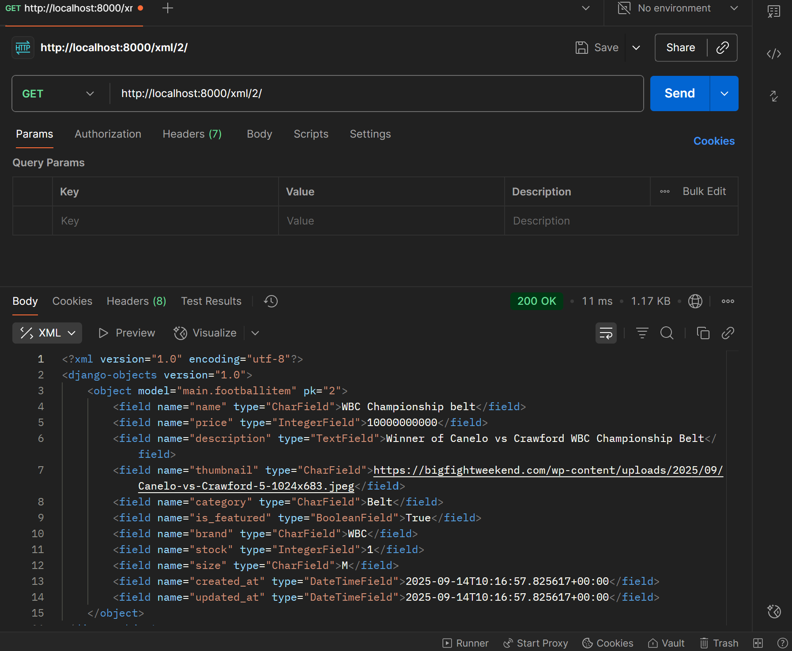

# Football Shop - Django Web Application

**Name:** Muhammad Rafi Nazir Pratama  
**Student ID:** 2406453556  
**Class:** KKI  

## PWS Application Link
**Application URL:** [https://muhammad-rafi416-footballshop.pbp.cs.ui.ac.id](https://muhammad-rafi416-footballshop.pbp.cs.ui.ac.id)

---

## Checklist Implementation Step-by-Step

### 1. Creating a New Django Project
- Created project directory `football-shop`
- Ran `django-admin startproject football_shop .` to create Django project
- Configured virtual environment for dependency isolation

### 2. Creating `main` Application
- Ran `python manage.py startapp main` to create main application
- Added `'main'` to `INSTALLED_APPS` in `settings.py`

### 3. Project Routing Configuration
- Configured `football_shop/urls.py` to include main application URLs
- Added `path('', include('main.urls'))` to urlpatterns
- Created `main/urls.py` with routing to `show_main` view

### 4. Creating `FootballItem` Model
Created model with required attributes:
```python
class FootballItem(models.Model):
    name = models.CharField(max_length=255)           # Item name
    price = models.IntegerField()                     # Item price  
    description = models.TextField()                  # Item description
    thumbnail = models.URLField(max_length=500)       # Item image
    category = models.CharField(max_length=100)       # Item category
    is_featured = models.BooleanField(default=False)  # Featured status
    
    # Additional attributes
    brand = models.CharField(max_length=100, blank=True, null=True)
    stock = models.IntegerField(default=0)
    size = models.CharField(max_length=10, blank=True, null=True)
    created_at = models.DateTimeField(auto_now_add=True)
    updated_at = models.DateTimeField(auto_now=True)
```

### 5. Creating Function in `views.py`
```python
def show_main(request):
    context = {
        'npm': '2406453556',
        'name': 'Muhammad Rafi Nazir Pratama',
        'class': 'KKI'
    }
    return render(request, "main.html", context)
```

### 6. Creating HTML Template
- Created `main/templates/` directory
- Created `main.html` with responsive design displaying application information
- Used Django template variables to display dynamic data

### 7. Database Migration
- Ran `python manage.py makemigrations` to create migration files
- Ran `python manage.py migrate` to apply migrations to database

### 8. PWS Deployment
- Configured `ALLOWED_HOSTS` with PWS domain
- Committed and pushed to PWS repository
- Accessed application through PWS URL

---

## Django Request-Response Diagram

```
┌─────────────────┐    HTTP Request     ┌─────────────────┐
│                 │ ──────────────────► │                 │
│   CLIENT        │                     │  DJANGO SERVER  │
│   (Browser)     │ ◄────────────────── │                 │
└─────────────────┘    HTTP Response    └─────────────────┘
                                                │
                                                ▼
                                    ┌─────────────────┐
                                    │    urls.py      │
                                    │  (URL Routing)  │
                                    │                 │
                                    │ • Pattern match │
                                    │ • Route to view │
                                    └─────────────────┘
                                                │
                                                ▼
                                    ┌─────────────────┐
                                    │    views.py     │
                                    │ (Business Logic)│
                                    │                 │
                                    │ • Process req   │
                                    │ • Query models  │
                                    │ • Prepare data  │
                                    └─────────────────┘
                                                │
                                    ┌───────────┴───────────┐
                                    ▼                       ▼
                        ┌─────────────────┐    ┌─────────────────┐
                        │    models.py    │    │   template.html │
                        │   (Database)    │    │     (View)      │
                        │                 │    │                 │
                        │ • Data models   │    │ • HTML structure│
                        │ • ORM queries   │    │ • Template tags │
                        │ • Database ops  │    │ • Context data  │
                        └─────────────────┘    └─────────────────┘
```

### Component Relationship Explanation:

1. **urls.py**: Receives requests from client and determines which view will handle the request based on URL pattern
2. **views.py**: Executes business logic, interacts with models to fetch/manipulate data, and prepares context for template
3. **models.py**: Defines data structure and interacts with database through Django ORM
4. **template.html**: Receives context from views and renders HTML response sent back to client

---

## Role of `settings.py` in Django Project

`settings.py` is the central configuration file that manages all aspects of Django application:

### 1. **Database Configuration**
```python
DATABASES = {
    'default': {
        'ENGINE': 'django.db.backends.sqlite3',
        'NAME': BASE_DIR / 'db.sqlite3',
    }
}
```

### 2. **Installed Applications**
```python
INSTALLED_APPS = [
    'django.contrib.admin',
    'django.contrib.auth',
    'main',
]
```

### 3. **Middleware Configuration**
- Manages middleware order that processes request/response
- Security, authentication, CORS, etc.

### 4. **Template Configuration**
- Manages template directories and template engine
- Context processors for global data

### 5. **Static Files & Media**
- Configuration for CSS, JavaScript, image files
- URLs and directories for static files

### 6. **Security Settings**
- `SECRET_KEY`: Secret key for cryptography
- `DEBUG`: Debug mode (True for development)
- `ALLOWED_HOSTS`: Domains allowed to access the application

### 7. **Internationalization**
- `LANGUAGE_CODE`: Default language
- `TIME_ZONE`: Time zone
- `USE_I18N`, `USE_TZ`: Internationalization settings

---

## How Database Migration Works in Django

### 1. **Migration Concept**
Migration is Django's way to apply model changes (database schema) to the database gradually and in a controlled manner.

### 2. **Migration Process**

#### **Step 1: Creating Migration**
```bash
python manage.py makemigrations
```
- Django compares current models with the last migration
- Creates new migration files in `app/migrations/`
- Files contain required operations (CREATE TABLE, ALTER TABLE, etc.)

#### **Step 2: Applying Migration**
```bash
python manage.py migrate
```
- Runs migration files that haven't been applied
- Changes database structure according to operations in migration files
- Records applied migrations in `django_migrations` table

### 3. **Migration System Benefits**
- **Version Control**: Every database change is recorded and trackable
- **Rollback**: Can revert to previous database versions
- **Team Collaboration**: Synchronizes database changes between developers
- **Deployment**: Automatically applies database changes in production

### 4. **Migration File**
Example migration file:
```python
# 0001_initial.py
from django.db import migrations, models

class Migration(migrations.Migration):
    initial = True
    dependencies = []
    
    operations = [
        migrations.CreateModel(
            name='FootballItem',
            fields=[
                ('id', models.BigAutoField(primary_key=True)),
                ('name', models.CharField(max_length=255)),
                ('price', models.IntegerField()),
            ],
        ),
    ]
```

---

## Why is Django Chosen for Initial Learning?

### 1. **"Packaged Beautifully**
- Django provides almost everything needed for web development
- Admin interface, ORM, authentication, security features built-in
- Reduces setup and configuration complexity

### 2. **Clear and Organized Structure**
- **MVT Pattern**: Model-View-Template that's easy to understand
- **Project Structure**: Consistent and logical file organization
- **Convention over Configuration**: Reduces confusing decisions

### 3. **Friendly Learning Curve**
- Very comprehensive and high-quality documentation
- Informative and helpful error messages
- Official step-by-step tutorials that are easy to follow

### 4. **Fundamental Web Development Concepts**
Django teaches important concepts such as:
- **HTTP Request/Response cycle**
- **Database modeling and ORM**
- **Template rendering**
- **URL routing**
- **Security best practices**

### 5. **Real-World Ready**
- Used by major companies (Instagram, Pinterest, Mozilla)
- Production-ready features (caching, security, scalability)
- Teaches best practices applicable in industry

### 6. **Python Ecosystem**
- Python as a readable and beginner-friendly language
- Clean and expressive syntax
- Large community and extensive libraries

### 7. **Rapid Development**
- Built-in admin interface for CRUD operations
- Automatic form generation
- Database migrations
- Development server with auto-reload

---

## Feedback for Tutorial 1 Teaching Assistant

*No Feedback*

---

## Assignment 3

### **Why do we need data delivery in implementing a platform?**
Because data delivery ensures that information flows efficiently between different parts of your platform. Without proper data delivery:
- Components can't communicate effectively
- Users experience delays or failures when requesting information
- The platform becomes fragmented and unreliable
- Scalability becomes impossible as bottlenecks form

---

### **XML or JSON?**
In my opinion JSON is more efficient, the structure is more clear and gets the job done, where as XML is more elaborate and might be more complex for beginner coders
**JSON is more popular because:**
- Lighter weight: Less "packaging material" means faster transmission
- JavaScript native: Like speaking the same language as web browsers
- Human readable: Easy to read and debug
- Simpler parsing: Less computational overhead
- Better for APIs: RESTful services prefer JSON's simplicity

---

### **What is the purpose of the is_valid() method?**
The is_valid() method is like a security checkpoint at an airport, it thoroughly inspects everything before allowing data to proceed into your application.
```python
form = ContactForm(request.POST)
if form.is_valid():  # The security checkpoint
    # Data is clean and safe to use
    cleaned_data = form.cleaned_data
    # Process the data...
```
**Why we need it?**
- Data validation: Ensures email addresses look like emails, numbers are actually numbers
- Security filtering: Removes malicious code or invalid characters
- Business logic enforcement: Applies your custom rules (like "age must be over 18")
- Error collection: Gathers all validation errors in one place for user feedback
Without is_valid(),you have no idea what dangerous or corrupted data might enter your system.

---

### **CSRF Token in Django Forms**
CSRF (Cross-Site Request Forgery) protection is like having a secret handshake that only your website knows
## **Why we need it?**
- Prevents impersonation: Ensures requests actually came from your site
- Validates origin: Like checking someone's ID before processing their request
- Session-specific: Each user gets their own unique "handshake"

## **What happens without CSRF protection:**
An attacker could create a malicious website with this form:
```html
html<!-- On malicious-site.com -->
<form action="https://yourbank.com/transfer" method="post">
    <input type="hidden" name="amount" value="1000">
    <input type="hidden" name="to_account" value="attacker-account">
    <input type="submit" value="Click for free prize!">
</form>
```
The attack scenario:
1. User logs into their bank account (yourbank.com)
2. User visits malicious-site.com in another tab
3. User clicks "Click for free prize!"
4. Their browser secretly submits the transfer form to the bank
5. Since the user is still logged in, the bank processes the transfer
6. Money gets stolen without the user knowing

CSRF tokens prevent this because the malicious site can't guess or obtain the victim's unique token - it's like trying to forge a signature you've never seen. The bank (Django) rejects any form submission without the correct secret handshake.
This protection is automatic in Django when you include  in your forms and use Django's middleware - it's like having a bouncer who knows all the right passwords.

---

## Implementation Step-by-Step

<!-- You can add screenshots here to show your application -->
<div align="center">
    
    <p><em>Main page showing football items with Add and Detail buttons</em></p>
</div>

### **1. Adding 4 New View Functions for Data Formats**

I implemented four new view functions in `main/views.py` to handle different data format requests:

#### **XML View (`show_xml`)**
```python
def show_xml(request):
    data = FootballItem.objects.all()
    xml_data = serializers.serialize("xml", data)
    return HttpResponse(xml_data, content_type="application/xml")
```
- Retrieves all `FootballItem` objects from database
- Uses Django's built-in `serializers.serialize()` to convert data to XML format
- Returns HTTP response with XML content type

#### **JSON View (`show_json`)**
```python
def show_json(request):
    data = FootballItem.objects.all()
    json_data = serializers.serialize("json", data)
    return HttpResponse(json_data, content_type="application/json")
```
- Similar to XML view but serializes data to JSON format
- Returns HTTP response with JSON content type

#### **XML by ID View (`show_xml_by_id`)**
```python
def show_xml_by_id(request, id):
    try:
        data = FootballItem.objects.filter(pk=id)
        xml_data = serializers.serialize("xml", data)
        return HttpResponse(xml_data, content_type="application/xml")
    except FootballItem.DoesNotExist:
        return HttpResponse(status=404)
```
- Accepts an `id` parameter from URL
- Filters database to get specific item by primary key
- Includes error handling for non-existent items (404 response)

#### **JSON by ID View (`show_json_by_id`)**
```python
def show_json_by_id(request, id):
    try:
        data = FootballItem.objects.filter(pk=id)
        json_data = serializers.serialize("json", data)
        return HttpResponse(json_data, content_type="application/json")
    except FootballItem.DoesNotExist:
        return HttpResponse(status=404)
```
- Same logic as XML by ID but returns JSON format
- Includes proper error handling

<!-- Screenshots showing API endpoints -->
<div align="center">
    <h4>API Endpoints Screenshots</h4>
    
    
    <p><em>XML and JSON API endpoints showing data serialization</em></p>
</div>

### **2. Creating URL Routings**

I updated `main/urls.py` to include URL patterns for all new views:

```python
from django.urls import path
from main.views import show_main, create_football_item, show_football_item_detail, show_xml, show_json, show_xml_by_id, show_json_by_id

app_name = 'main'

urlpatterns = [
    path('', show_main, name='show_main'),
    path('create_football_item/', create_football_item, name='create_football_item'),
    path('football_item/<int:id>/', show_football_item_detail, name='show_football_item_detail'),
    path('xml/', show_xml, name='show_xml'),
    path('json/', show_json, name='show_json'),
    path('xml/<int:id>/', show_xml_by_id, name='show_xml_by_id'),
    path('json/<int:id>/', show_json_by_id, name='show_json_by_id'),
]
```

**URL Pattern Explanations:**
- `xml/` - Returns all items in XML format
- `json/` - Returns all items in JSON format  
- `xml/<int:id>/` - Returns specific item by ID in XML format
- `json/<int:id>/` - Returns specific item by ID in JSON format
- `<int:id>` captures integer values from URL and passes them to view functions

### **3. Creating Main Webpage with Add Button and Detail Links**

I modified `main/templates/main.html` to display model objects with proper navigation:

#### **Add Button Implementation:**
```html
<a href="">
    <button>+ Add Football Item</button>
</a>
```
- Uses Django URL template tag to generate correct URL
- Links to the form page for adding new items

#### **Display Model Objects with Detail Links:**
```html

<div>
    <h2><a href="">{{ item.name }}</a></h2>
    
    <p><b>{{ item.category }}</b> | 
        <b>{{ item.brand }}</b> | 
        <b>Featured</b> | <i>{{ item.created_at|date:"d M Y H:i" }}</i> 
        | Price: Rp {{ item.price|floatformat:0 }}</p>
    
    
    
    <br />
    
    
    <p>{{ item.description|truncatewords:25 }}...</p>
    
    <p><a href=""><button>View Details</button></a></p>
</div>
<hr>

```

<!-- Screenshot showing the list of items -->
<div align="center">
    
    <p><em>List of football items with Add and Detail buttons</em></p>
</div>

**Key Features:**
- Loops through all football items using ``
- Each item title is a clickable link to detail page
- Shows truncated description (25 words)
- Includes "View Details" button for each item
- Displays item image if available
- Shows conditional information (brand, featured status)

#### **Updated show_main View:**
```python
def show_main(request):
    football_items = FootballItem.objects.all()

    context = {
        'npm' : '2406453556',
        'name': 'Muhammad Rafi Nazir Pratama',
        'class': 'KKI',
        'football_items': football_items,
    }

    return render(request, "main.html", context)
```
- Added `football_items` to context to pass all items to template

### **4. Creating Form Page**

I created `main/templates/create_football_item.html` for adding new items:

<!-- Screenshot of the form page -->
<div align="center">
    
    <p><em>Form page for adding new football items</em></p>
</div>

```html
<form method="POST">
    
    <table>
        {{ form.as_table }}
        <tr>
            <td></td>
            <td>
                <input type="submit" value="Add Football Item" />
            </td>
        </tr>
    </table>
</form>
```

#### **Form View Implementation:**
```python
def create_football_item(request):
    form = FootballItemForm(request.POST or None)

    if form.is_valid() and request.method == "POST":
        form.save()
        return redirect('main:show_main')

    context = {'form': form}
    return render(request, "create_football_item.html", context)
```

**How it Works:**
- Creates form instance with POST data if available
- Validates form data using `is_valid()`
- Saves new item to database if valid
- Redirects to main page after successful creation
- Includes CSRF token for security

### **5. Creating Detail Page**

I created `main/templates/show_football_item_detail.html` to display individual item details:

<!-- Screenshot of the detail page -->
<div align="center">
    
    <p><em>Detail page showing complete information about a football item</em></p>
</div>

```html
<h1>{{ football_item.name }}</h1>
<p><b>{{ football_item.category }}</b> | 
    <b>{{ football_item.brand }}</b> | 
    <b>Featured</b> | <i>{{ football_item.created_at|date:"d M Y, H:i" }}</i></p>

<p>Price: Rp {{ football_item.price|floatformat:0 }}</p>


<p><b>Size:</b> {{ football_item.size }}</p>


<p><b>Stock:</b> {{ football_item.stock }} items available</p>



<br /><br />


<p>{{ football_item.description }}</p>
```

#### **Detail View Implementation:**
```python
def show_football_item_detail(request, id):
    football_item = get_object_or_404(FootballItem, pk=id)

    context = {
        'football_item': football_item,
    }

    return render(request, "show_football_item_detail.html", context)
```

**Key Features:**
- Uses `get_object_or_404()` for automatic 404 handling
- Displays all item attributes including conditional fields
- Shows full description (not truncated)
- Larger image display (300px width)
- Back navigation to main page

**Implementation Summary:**
1. **Data API Views**: Created XML/JSON endpoints for all items and individual items
2. **URL Routing**: Configured clean URL patterns for all views
3. **Main Page**: Enhanced to show all items with navigation buttons
4. **Form Page**: Implemented secure form with CSRF protection
5. **Detail Page**: Created comprehensive item detail display with proper error handling

All implementations follow Django best practices including proper error handling, security measures (CSRF tokens), and clean URL routing.

---

## Feedback for the teaching assistants for Tutorial 2

*No feedback*

---

## Postman XML Image


## Postman JSON Image


## Postman XML by ID image



## Postman JSON by ID image

